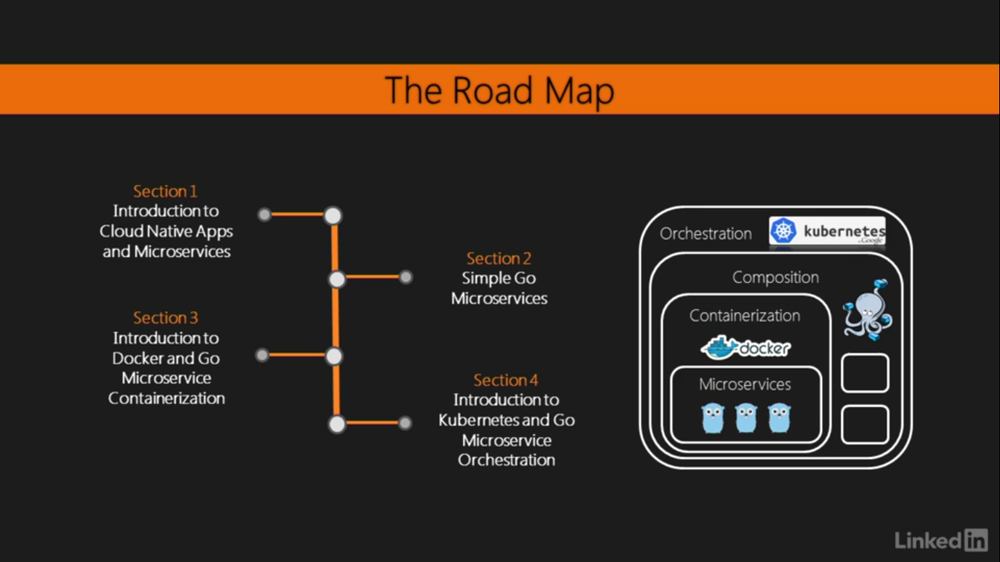
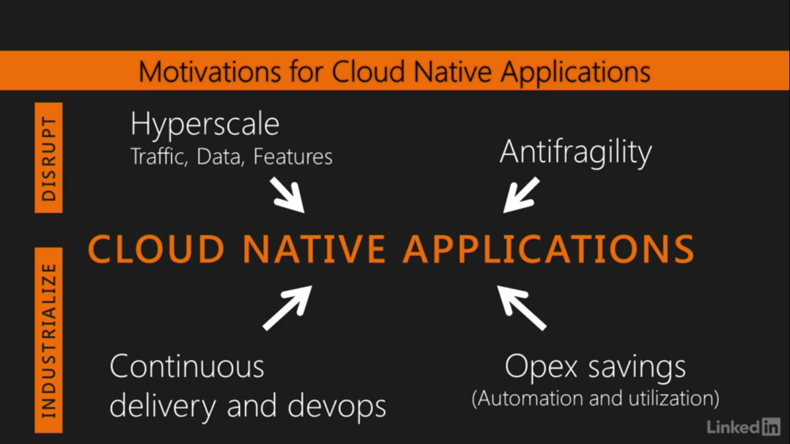
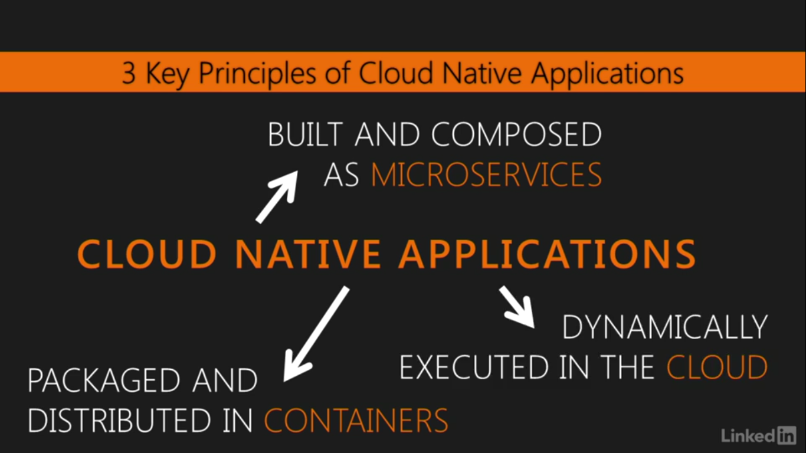
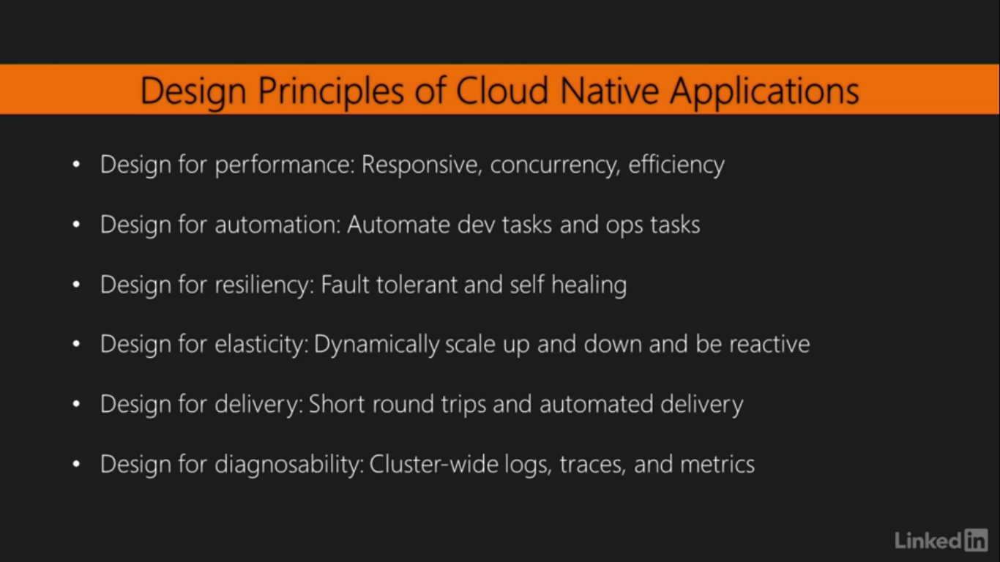
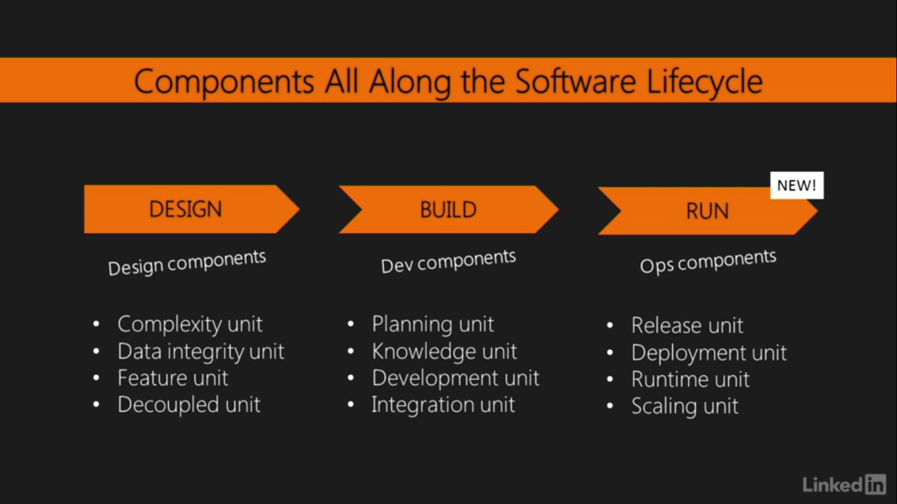
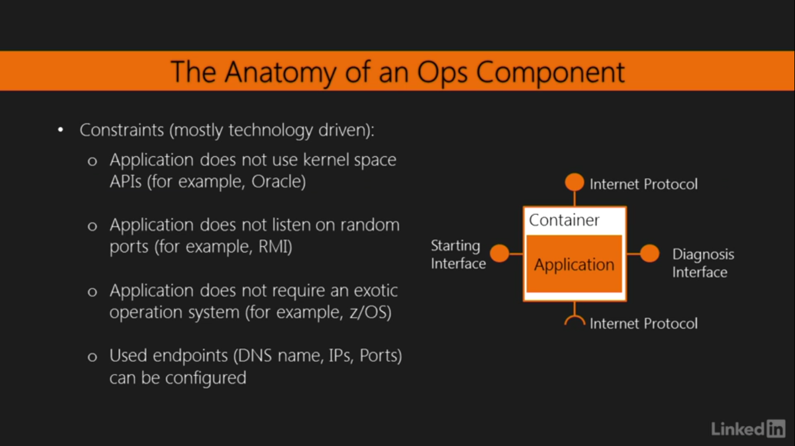
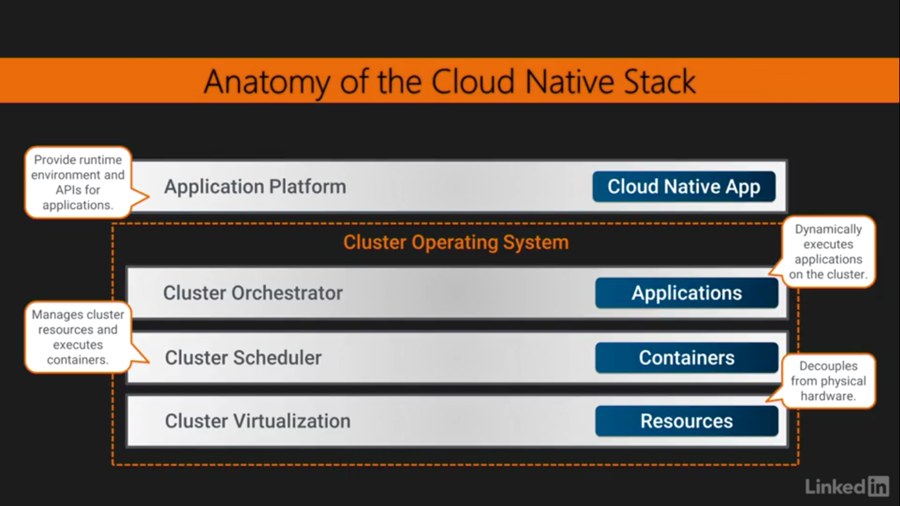
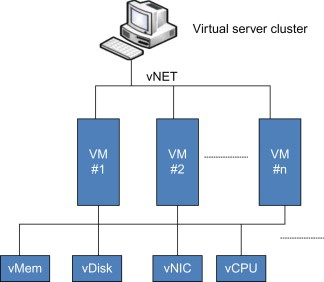

# Introduction to Cloud Native GO

This is summary of this excellent [course](https://www.linkedin.com/learning/getting-started-with-cloud-native-go) by [Mario-Leander Reimer](https://www.linkedin.com/learning/instructors/mario-leander-reimer). If you are new to cloud native technologies, I recommend you to take this free course.

All credits to the course author. I have just added and explained some keywords.

## Outline

1. Introduction to Cloud Native Apps and Microservices
   1. Prerequisites
   2. Motivation for cloud native apps
   3. Key principles for cloud native apps
   4. Design principles and challenges
   5. Decomposition with microservices
   6. The Cloud Native Stack

## Introduction to Cloud Native Apps and Microservices

The section explains why we need cloud native apps and what are the key principles to design them.
What we need to design and develop these apps.
But this design comes with cost. This will be explained in further sections.

### 1.1 Prerequisites

- [Go installation](https://golang.org/doc/install)
- IDE
- [Native docker installation](https://docs.docker.com/get-docker/)
- [kubectl](https://kubernetes.io/docs/tasks/tools/install-kubectl/) and [minikube](https://kubernetes.io/docs/tasks/tools/install-minikube/) installation

### 1.2 Motivation for cloud native apps

- **Hyperscale** – Need scale applications for growing demand of data, traffic, features.
- **Antifragility** – Cloud native apps don’t break completely. Means only a part of system is affected on failures, and system keeps running.
- **Continuous delivery and Devops** – We can deliver new features, fixes more frequently.
- **Opex savings** (Automation and Utilization) – We can save **operation expenses**. We pay as we use and save resources. An **orchestrator** plays important role by upscaling and downscaling these applications.

### 1.3 Key principles for cloud native apps

These principles define how we **design**, **ship** and **execute** our applications.

- **Built and composed as Microservices _(Design)_**

  > Microservices architecture is an approach in which a single application is composed of many loosely coupled and independently deployable smaller services.

  Here are the key benefits

  1. Independently deployable (_Antifragility_)
  2. Each can be developed with different technology that benefits us.
  3. We can scale precisely instead of scaling whole application.

  I recommend you to read [this article](https://www.ibm.com/cloud/learn/microservices) to know more.

- **Packaged and distributed in containers _(Ship)_**

  The microservices or a single microservice is packaged as container. This enables microservices to be scaled, managed and monitored easily.

  Here are the key benefits

  1. Containers are very lightweight and can be started and destroyed on the fly (_Hyperscale_).
  2. Portable and platform independent. Because _it just works in the container_.
  3. Better resource utilization than the virtual machines (_Opex savings_).

  I recommend you to read [this article](https://www.ibm.com/cloud/learn/containers) to know more.

- **Dynamically executed in cloud _(Execute)_**
  Cloud provides the execution environment for our apps. An orchestrator manages the cloud application. The cloud provides virtualized pool of resources as the application demands.

  > When customers procure cloud services, the provider fulfills those requests using advanced automation rather than manual provisioning. The key advantage is agility: the ability to apply abstracted compute, storage, and network resources to workloads as needed and tap into an abundance of prebuilt services.

  I recommend you to read [this article](https://www.infoworld.com/article/2683784/what-is-cloud-computing.html) to know more.

### 1.4 Design principles and challenges

### 1.5 Decomposition with microservices

- Decomposing your application in small components

  Take a note of ops component. It differentiate our cloud native apps from other.

  

- Understanding ops components

  OPS component is an application packaged in a container. It communicates with the help of provided interfaces. It comes with constraints mentioned in following image.

  

- Decomposition trade-offs

  So if we want to move to cloud native app following are the advantages and disadvantages.

  **Advantages**

  1. Flexible scaling
  2. Runtime isolation
  3. Automated release and deployments
  4. Higher resource utilization

  **Disadvantages**

  1. Distribution debt: As all microservices communicate through network calls. This adds up latency.
  2. Increased infrastructure complexity.
  3. Increased integration complexity.
  4. Increased troubleshooting complexity.
  5. Need of monitoring and debugging services.

### 1.6 The Cloud Native Stack

It is a 4 layered architecture.

- Cluster virtualization

  Decouples our system(above layers) from physical hardware. A cluster is a pool of **resources**. The virtualization abstracts this complexity and acts as a single resource.

  

  We are using [**Docker**](https://www.docker.com/) at this layer. Now our application is containerized and it is independent of underlying system as we are executing our Docker Image in a Container.

- Cluster scheduler

  Manages the cluster resources and executes the **containers** on the resources.

  > The method of matching tasks to the resources at particular times is referred to as scheduling.

  We are using [**Kubernetes**](https://kubernetes.io/) at this layer.

- Cluster orchestrator

  Dynamically executes the **applications** on the cluster. The orchestrator communicates with the scheduler to execute the application _container_ with given resources.

  We are using [**Kubernetes**](https://kubernetes.io/) at this layer.

- Application

  Provide runtime environment and APIs for the applications. This includes any programming language.

  We are using [**Go**](https://golang.org/) at this layer.

Have a look at [Cloud Native Landscape](https://github.com/cncf/landscape). These all the available options for each layer.
